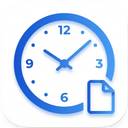

<p align="center">
  
</p>

<h1 align="center">TimeDoc</h1>

<p align="center">
  A Windows desktop app for tracking work hours and automatically generating invoices and timesheets as Word and Excel documents.
</p>

<p align="center">
  <a href="../../releases"></a>
  <a href="LICENSE"></a>
  <a href="../../releases"></a>
</p>

## Features

- **Hour Tracking** — Log daily work hours with start time, end time, break duration, and notes
- **Template-Based Export** — Use your own Word (.docx) and Excel (.xlsx) templates with placeholders that get filled automatically
- **Invoice & Timesheet Generation** — Export professional documents at the end of each month with one click
- **Email Template** — Pre-filled email draft with all relevant data, ready to copy and send — with optional month override
- **Contact Us** — Send feedback, bug reports, or feature requests directly from the app with mail client selection (Default, Outlook.com, Gmail, Yahoo Mail, Thunderbird)
- **Custom Fields** — Define your own variables in Settings and use them as placeholders in templates and emails
- **Smart Data Import** — Paste time entries from any source — supports tabs, semicolons, commas, multiple date/time formats (DD.MM.YY, 2026-03-01, March 1, 9h, 2:30 PM, ...), header detection, and hours-only lines
- **Backup System** — Automatic daily backups, manual backup creation, and export/import to USB or any folder
- **Sensitive Data Protection** — IBAN and BIC are encrypted (AES-256-GCM) and optionally password-protected
- **Multi-Language** — Full English and German support with a language toggle in Settings
- **What's New** — See the latest features after each major update, accessible anytime via the nav icon
- **Portable Mode** — Run without installation, carry your data on a USB stick
- **Auto-Update** — The app checks for updates on startup and installs them automatically

## Download

Go to the [Releases](../../releases) page and download:

- **TimeDoc Setup x.x.x.exe** — Installer (recommended)
- **TimeDoc x.x.x.exe** — Portable version (no installation needed)

> **Note:** Windows may show a SmartScreen warning ("Windows protected your PC") because the app is not code-signed. Click **"More info"** and then **"Run anyway"** to proceed. The app is open source — you can review the full source code in this repository.

## Development

### Prerequisites

- [Node.js](https://nodejs.org/) 20+
- npm

### Setup

```bash
git clone https://github.com/Ay010/TimeDoc.git
cd TimeDoc
npm install
```

### Run in Development

```bash
npm run electron:dev
```

### Build

```bash
npm run build
```

The output will be in the `release/` folder.

## Tech Stack

- **Electron** — Desktop framework
- **React + TypeScript** — UI
- **Tailwind CSS** — Styling
- **SQLite (sql.js)** — Local database
- **docxtemplater** — Word document generation
- **ExcelJS** — Excel document generation
- **Vite** — Build tool
- **electron-builder** — Packaging

## Release

Pushing a version tag triggers an automatic build and GitHub Release:

```bash
git tag v1.0.0
git push origin v1.0.0
```

## License

[MIT](LICENSE)
